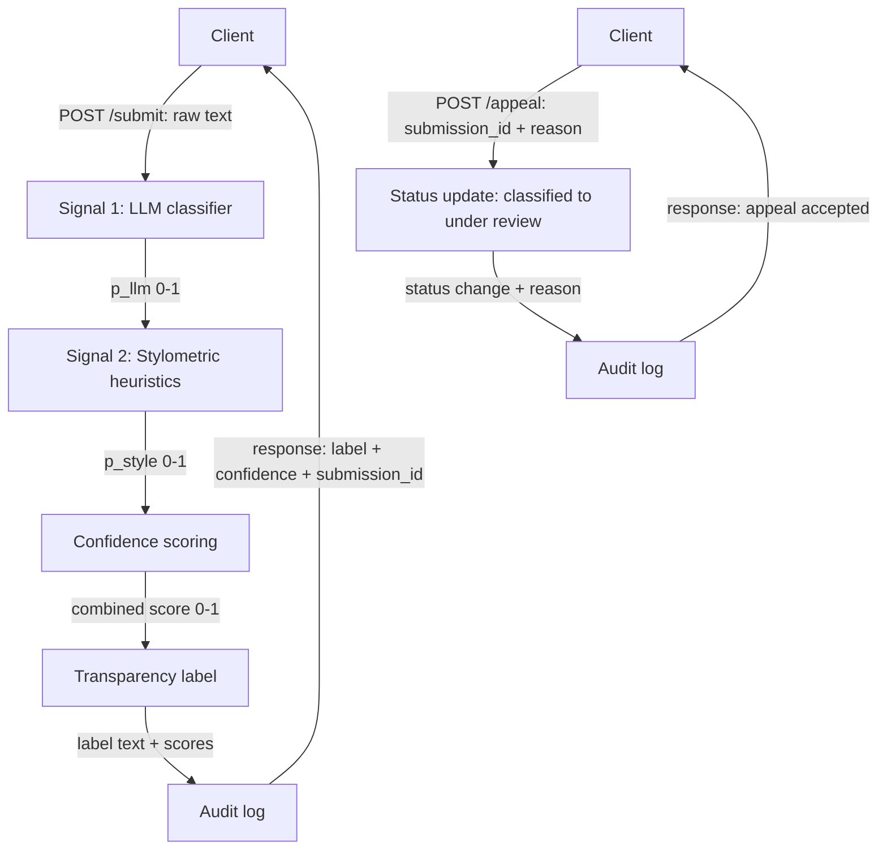

# Project 4 — Provenance Guard

## Architecture Overview



**Submission flow:** A client posts raw text to `/submit`; it passes through the LLM classifier and the stylometric heuristics, whose scores are combined into a single confidence, mapped to a transparency label, logged, and returned. **Appeal flow:** A client posts a `submission_id` and reason to `/appeal`; the system flips that submission's status to `under review`, logs the appeal, and confirms it.

## Detection Signals

Two complementary signals are combined as `0.6 * p_llm + 0.4 * p_style`. The LLM
carries more weight because it judges *meaning*; the stylometric signal is a
cheap, deterministic structural check that catches what the LLM misses.

### Signal 1: LLM classifier (`p_llm`, 0–1)

- **Measures:** a Groq `llama-3.1-8b-instant` model's estimated probability the
  text was AI-written, guided by a rubric (generic phrasing, hedging, transition
  words, uniform polish vs. typos, slang, personal voice).
- **Why:** captures *semantic* tells — tone, voice, formulaic structure — that
  no hand-coded metric can. Cheap, fast, and decisive after prompt calibration.
- **Misses:** lightly edited AI text and "AI-sounding" humans (formal writers);
  no ground truth, so it can be confidently wrong; depends on a network call
  (falls back to 0.5 on any failure).

### Signal 2: Stylometric heuristics (`p_style`, 0–1)

- **Measures:** structural uniformity from three averaged metrics — sentence-
  length uniformity (low coefficient of variation), lexical repetition (low
  type-token ratio), and punctuation regularity (closeness to a moderate
  density). Higher = more machine-like evenness.
- **Why:** fully local, deterministic, and free — a sanity check independent of
  the LLM that flags the "too even" rhythm typical of generated prose.
- **Misses:** short texts (needs ≥2 sentences for variance); blind to meaning,
  so it can't tell polished human writing from AI, and is easily defeated by
  adding length variation. Thresholds (e.g. 0.12 punctuation/word) are
  hand-tuned, not learned.

## Confidence Scoring

<!-- how you combined signals into a score, how you validated it's meaningful, and two example submissions with noticeably different confidence scores (one high-confidence, one lower-confidence) showing the actual scores. In the confidence-scoring section, include two example submissions with noticeably different confidence scores — one high-confidence and one lower-confidence case — showing the actual scores (you can lift these from your Milestone 4 testing). This is what shows your scoring produces meaningful variation, not a constant. -->

The two signals are combined into a single AI-likelihood score with a weighted average, `confidence = 0.6 * p_llm + 0.4 * p_style`, then clamped to 0–1. The LLM gets more weight because it judges meaning; the stylometric signal acts as a structural counterweight. The score maps to three labels: `≥ 0.7` → Likely AI-generated, `0.4–0.7` → Uncertain, `< 0.4` → Likely human-written.

**Validation.** I ran four deliberately chosen inputs (clearly AI, clearly human, formal human, lightly edited AI) through `test_scoring.py`, printing each signal separately. The four scores spread meaningfully across all three labels, proving the pipeline produces variation, not a near-constant.

**Example submissions:**

| Input | p_llm | p_style | confidence | Label |
| ----- | ----- | ------- | ---------- | ----- |
| *High-confidence:* textbook-AI paragraph ("transformative paradigm shift… It is important to note… Furthermore…") | 0.92 | 0.37 | *0.70* |  Likely AI-generated (confidence 0.7+). This text shows strong signals of automated generation. This is an estimate, not proof; the user may appeal. |
| *Lower-confidence:* casual human review ("ok so i finally tried that new ramen place downtown and honestly? underwhelming…") | 0.12 | 0.22 | *0.16* | ✓ Likely human-written (confidence under 0.4). This text shows signals consistent with human writing. This is an estimate, not proof. |

## Transparency Label

<!-- typed description of all three variants (high-confidence AI, human, uncertain) showing the exact text each one displays -->

The combined confidence maps to one of three labels. Each names a likelihood,
not a verdict, and states it is an estimate.

- **Likely AI** (confidence ≥ 0.7):
  > ⚠️ Likely AI-generated (confidence 0.7+). This text shows strong signals of automated generation. This is an estimate, not proof; the user may appeal.
- **Uncertain** (0.4 ≤ confidence < 0.7):
  > ❓ Uncertain (confidence 0.4–0.7). Our signals disagree or are weak; we cannot confidently classify this text. Treat the result with caution.
- **Likely human** (confidence < 0.4):
  > ✓ Likely human-written (confidence under 0.4). This text shows signals consistent with human writing. This is an estimate, not proof.


## Rate Limiting

The `/submit` endpoint is rate-limited per client IP (Flask-Limiter, in-memory
storage) with **`10 per minute; 100 per day`**.

**Reasoning.** A genuine writer submitting their own work checks a handful of
drafts at a time — 10/minute leaves ample headroom for revising and re-checking
a piece without ever hitting the wall, while still cutting off a script that
would otherwise fire hundreds of requests per minute. The 100/day ceiling caps
sustained automated abuse (and the cost of the per-submission Groq call) at a
level a human reviewer would essentially never reach in normal use. The limits
apply only to `/submit`; read-only routes (`/health`, `/log`) and `/appeal` are
unthrottled.

**Verification.** Sending 12 rapid `POST /submit` requests shows the first 10
accepted and the rest rejected with `429 Too Many Requests`:

```
200
200
200
200
200
200
200
200
200
200
429
429
```

## Audit Log

Every classification appends one structured JSON line to `audit_log.jsonl`
capturing the timestamp, content ID, attribution label, combined confidence,
both individual signal scores (`llm_score`, `style_score`), and status; appeals
are recorded as separate `event: "appeal"` entries. Sample entries:

```json
{"content_id": "c6feb1e1-0ea2-4c78-830e-916f1cfe665f", "creator_id": "u1", "timestamp": "2026-06-29T19:03:06.890594+00:00", "attribution": "\u26a0\ufe0f Likely AI-generated (confidence 0.7+). This text shows strong signals of automated generation. This is an estimate, not proof; the user may appeal.", "confidence": 0.7041367521367522, "llm_score": 0.92, "style_score": 0.3803418803418803, "status": "classified"}
{"content_id": "33e39b76-7786-45b1-8c0f-b58053bb6ec1", "creator_id": "u2", "timestamp": "2026-06-29T19:03:37.818740+00:00", "attribution": "\u2713 Likely human-written (confidence under 0.4). This text shows signals consistent with human writing. This is an estimate, not proof.", "confidence": 0.14039506172839508, "llm_score": 0.02, "style_score": 0.32098765432098764, "status": "classified"}
{"content_id": "832cd85f-af65-45dd-bd49-6839956fbc5f", "creator_id": "u3", "timestamp": "2026-06-29T19:03:47.641726+00:00", "attribution": "\u2753 Uncertain (confidence 0.4\u20130.7). Our signals disagree or are weak; we cannot confidently classify this text. Treat the result with caution.", "confidence": 0.6347276972864604, "llm_score": 0.92, "style_score": 0.206819243216151, "status": "classified"}
{"content_id": "566a32ea-9755-4d15-a75e-7a5b9a115b16", "creator_id": "u1", "timestamp": "2026-06-29T18:51:53.144931+00:00", "event": "appeal", "creator_reasoning": "I wrote this myself from personal experience. I am a non-native English speaker and my writing style may appear more formal than typical.", "original_label": "\u26a0\ufe0f Likely AI-generated (confidence 0.7+). This text shows strong signals of automated generation. This is an estimate, not proof; the user may appeal.", "original_confidence": 0.7196767676767677, "status": "under review"}
```

## Known Limitations

<!-- at least one specific type of content your system would likely misclassify and why. Write the known limitations section honestly. Name at least one specific type of content your system would likely get wrong and explain why — tied to a property of your signals, not a generic "it needs more data." -->

- **Polished formal human writing (false positive).** A careful academic or
  business writer produces even sentence lengths, repeated terminology, and
  moderate punctuation — exactly the uniformity `p_style` reads as machine-like,
  and the same hedging/transition cues the LLM rubric treats as AI tells. Such
  text is routinely over-scored toward "Likely AI."
- **Lightly edited AI text (false negative).** Breaking up a few sentences and
  adding a typo or aside collapses the stylometric uniformity signal and weakens
  the LLM's cues, pushing genuinely AI-generated text down into "Uncertain" or
  "Likely human."
- **Short inputs.** Under two sentences, `p_style` has no variance to measure and
  returns a neutral 0.5, so very short submissions are decided almost entirely by
  the LLM signal.


## Spec Reflection

<!-- one way the spec helped you, one way implementation diverged from it and why -->

One way the spec in planning.md helped me is through constructing the Architecture diagram to get an understanding of how the complete system will look like as it helped me take more targeted actions and design decisions towards implementing it. One way implementation diverged from the spec is that initially, I wanted to set the status of the post from `classified` to `appealed` when a user asks to appeal the classification, but then I decided to change the status to `under review` instead to more realistically reflect that the appeal is being reviewed by humans.

## AI Usage

<!-- at least 2 specific instances describing what you directed the AI to do and what you revised or overrode -->

**Instance 1**

- *What I gave the AI:* I gave Claude Code my detection-signals and uncertainty-representation spec, asking it to generate Signal 2 plus the confidence scoring.
- *What it produced:* A working pipeline, but testing on the four Milestone 4 inputs showed the LLM signal clustered every input at 0.32–0.42. Even textbook-AI prose scored only 0.42 ("Uncertain"), so the combined score was miscalibrated.
- *What I changed or overrode:* I had it isolate the cause (the terse Signal 1 prompt, not the parser or stylometric signal) and rewrite the prompt with an explicit rubric of AI vs. human tells and a "use the full 0–1 range" instruction. After re-testing, the textbook-AI case rose to 0.92 and the four inputs spread correctly across all three labels.

**Instance 2**

- *What I gave the AI:* When running `signals.py` directly threw `groq.GroqError: The api_key client option must be set...`, I reported the traceback and told the AI I had already pasted my key into `.env`.
- *What it produced:* It diagnosed that only `app.py` called `load_dotenv()`, so `signals.py` never loaded `.env` when run standalone, and the `Groq()` client was constructed outside the `try` block, so a missing key crashed instead of degrading.
- *What I changed or overrode:* I had it add `load_dotenv()` to `signals.py` and move the client construction inside the `try`, so a missing/invalid key now falls back to a neutral `0.5` score instead of raising.

## Demo Video

Link: https://drive.google.com/file/d/1DWGDpS5haKcXwnmafEFjBOp_qWOICp3x/view?usp=sharing

This demo video includes the following:
- Introduction to Provenance Guard's architecture including the submission flow and appeal flow
- Starting the server in a terminal with `python app.py`
- In another terminal, testing the system on a high-confidence AI input with:
```
$r = Invoke-RestMethod -Uri http://127.0.0.1:5000/submit -Method Post -ContentType "application/json" -Body '{"creator_id":"u1","text":"This transformative paradigm shift represents a fundamental advancement. It is important to note that the implications are significant. Furthermore, the comprehensive framework ensures optimal outcomes across all stakeholders."}'
$r
```
- Testing the system on a human text input with:
```
Invoke-RestMethod -Uri http://127.0.0.1:5000/submit -Method Post -ContentType "application/json" -Body '{"creator_id":"u2","text":"ok so i finally tried that new ramen place downtown and honestly? underwhelming. broth was kinda flat, noodles mushy. my friend liked hers tho lol"}'
```
- Testing the appeal flow with:
```
Invoke-RestMethod -Uri http://127.0.0.1:5000/appeal -Method Post -ContentType "application/json" -Body "{`"content_id`":`"$($r.content_id)`",`"creator_reasoning`":`"I wrote this myself, I am a non-native English speaker so my writing looks formal.`"}"
```
- Showing the `audit_log.jsonl` file with the submission and appeal audit logs
- Illustrating design choices through the Rate Limiting and Known Limitations sections of `README.md`