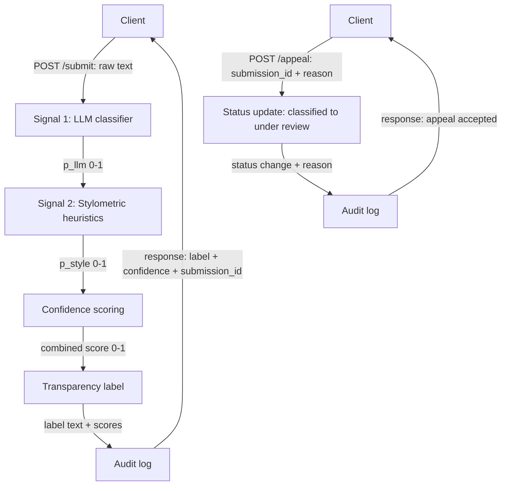

# Provenance Guard: Project Plan

## Detection Signals

<!-- What are your 2+ signals? What does each one measure? What does each signal's output look like (a score between 0–1? a binary flag?), and how will you combine them into a single confidence score? Your system needs at least 2 distinct signals. "Distinct" means they capture genuinely different properties of the text — not two versions of the same approach. A strong default pairing:

- LLM-based classification (Groq): ask the model to assess whether text reads as human or AI-generated. Captures semantic and stylistic coherence holistically.
- Stylometric heuristics: measurable statistical properties that differ between human and AI writing — sentence length variance, type-token ratio (vocabulary diversity), punctuation density, or average sentence complexity. AI text tends to be more uniform; human writing is more variable. Computable in pure Python.
These two signals are genuinely independent: one is semantic, one is structural. That makes the combination more informative than either alone. -->

**Signal 1 — LLM classification (Groq).** Prompts a Groq-hosted model to rate how likely the text is AI-generated. Output: a float `p_llm` in 0–1 (probability of AI).

**Signal 2 — Stylometric heuristics (pure Python).** Computes sentence-length variance, type-token ratio, and punctuation density, then maps the combined "uniformity" of the text to `p_style` in 0–1 (higher = more machine-like uniformity). Output: a float in 0–1.

**Combination.** Weighted average: `confidence = 0.6 * p_llm + 0.4 * p_style`, giving the semantic signal slightly more weight. Result is a single AI-likelihood score in 0–1.

## Uncertainty Representation

<!-- What does a confidence score of 0.6 mean to your system? How will you map raw signal outputs to a calibrated score? What threshold separates "likely AI" from "uncertain" from "likely human"? -->

A confidence of 0.6 means the system estimates a 60% likelihood the text is AI-generated — it is *not* a certainty, and the 0.4–0.6 band is treated as genuine uncertainty. Raw signal outputs are each clamped to 0–1 and combined via the weighted average above, so the calibrated score stays in 0–1. Thresholds:

- `confidence >= 0.7` → **likely AI**
- `0.4 <= confidence < 0.7` → **uncertain**
- `confidence < 0.4` → **likely human**

## Transparency Label Design

<!-- What exact text will the label show for a high-confidence AI result? A high-confidence human result? An uncertain result? Write out the three label variants now, before you build the UI. -->

- **Likely AI:** "⚠️ Likely AI-generated (confidence 0.7+). This text shows strong signals of automated generation. This is an estimate, not proof; the user may appeal."
- **Likely human:** "✓ Likely human-written (confidence under 0.4). This text shows signals consistent with human writing. This is an estimate, not proof."
- **Uncertain:** "❓ Uncertain (confidence 0.4–0.7). Our signals disagree or are weak; we cannot confidently classify this text. Treat the result with caution."

## Appeals Workflow

<!-- Who can submit an appeal? What information do they provide? What does the system do when an appeal is received — what status changes, what gets logged? What would a human reviewer see when they open the appeal queue? -->

Anyone who received a classification can appeal by submitting `POST /appeal` with the original `submission_id` and a short free-text reason. On receipt, the system looks up the submission, sets its status from `classified` to `under review`, and writes an audit-log entry recording the submission ID, the appeal reason, and the timestamp. A human reviewer opening the appeal queue sees, for each appealed item: the original text, the signal scores and combined confidence, the label that was shown, the appellant's reason, and the appeal timestamp.

## Anticipated Edge Cases

<!-- What types of content will your system handle poorly? Name at least two specific scenarios — not generic risks like "inaccurate detection," but specific cases like "a poem with heavy use of repetition and simple vocabulary that your heuristics might score as AI-generated." -->

- **Highly structured human writing** (legal boilerplate, technical specs, formatted recipes): uniform sentence length and low vocabulary diversity make the stylometric signal flag it as AI even though a human wrote it.
- **AI text edited by a human** (paraphrased, sentences merged/split, idioms added): introduces the burstiness and variability the heuristics rely on, pushing both signals toward "human" and producing false negatives.
- **Very short inputs** (one or two sentences): too little text for stable variance/type-token statistics, so the stylometric signal is unreliable and confidence should be widened toward "uncertain."

## Architecture

<!-- Turn your architecture narrative into a diagram. Draw the two main flows: (1) submission flow — POST /submit → signal 1 → signal 2 → confidence scoring → transparency label → audit log → response; (2) appeal flow — POST /appeal → status update → audit log → response. Label each arrow with what passes between components (raw text, signal score, combined score, label text). Generate a Mermaid diagram code block for the diagram. Include this diagram in this section and a 2–3 sentence narrative describing the submission and appeal flows. -->

**Submission flow:** A client posts raw text to `/submit`; it passes through the LLM classifier and the stylometric heuristics, whose scores are combined into a single confidence, mapped to a transparency label, logged, and returned. **Appeal flow:** A client posts a `submission_id` and reason to `/appeal`; the system flips that submission's status to `under review`, logs the appeal, and confirms acceptance.

## AI Tool Plan

<!-- For each of the three implementation milestones, specify:

M3 (submission endpoint + first signal): Which spec sections you'll provide to the AI tool (hint: your detection signals section + the diagram), what you'll ask it to generate (Flask app skeleton + the first signal function), and how you'll verify the output (test with a few inputs directly before wiring into the endpoint).
M4 (second signal + confidence scoring): Which spec sections you'll provide (detection signals + uncertainty representation + diagram), what you'll ask for (second signal function + scoring logic), and what you'll check (do scores vary meaningfully between clearly AI and clearly human text?).
M5 (production layer): Which spec sections you'll provide (label variants + appeals workflow + diagram), what you'll ask for (label generation logic + the /appeal endpoint), and how you'll verify (test all three label variants are reachable and that an appeal updates status correctly). -->

**M3 — submission endpoint + first signal.** Provide the Detection Signals section and the architecture diagram. Ask for a Flask app skeleton with a `/submit` route and the Signal 1 (Groq LLM) function returning `p_llm`. Verify by calling the signal function directly on a few sample texts before wiring it into the endpoint.

**M4 — second signal + confidence scoring.** Provide Detection Signals, Uncertainty Representation, and the diagram. Ask for the Signal 2 stylometric function (`p_style`) plus the weighted-average scoring logic. Check that scores vary meaningfully between clearly-AI and clearly-human samples and land in the expected threshold bands.

**M5 — production layer.** Provide the Transparency Label Design, Appeals Workflow, and the diagram. Ask for the label-generation logic and the `/appeal` endpoint with status updates and audit logging. Verify all three label variants are reachable and that an appeal flips a submission's status from `classified` to `under review`.